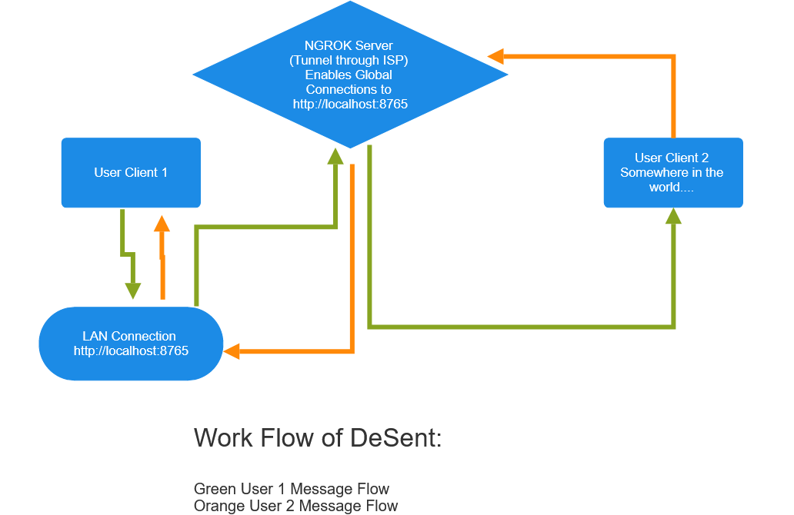
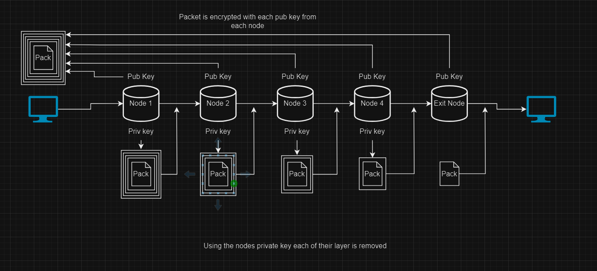

# DeSent

A decentralized text messaging application that uses Ngrok, so not decentralized but this is being used as a proof of concept.

Statuse: STABLE

# INSTALL PROCESS (SERVER ONLY)

```git clone https://github.com/KaiserWilhelm23/desent.git ```

``` cd desent ```

``` chmod +x install.sh ``` 

``` sudo ./install.sh ``` Will install Ngrok and python dependencies


The Basic Message Flow. 


Encryption and Onion Route Plan. 

